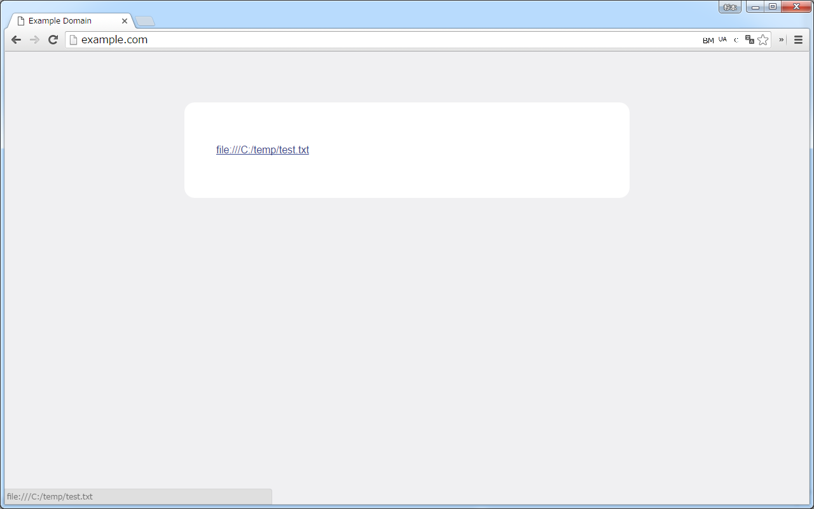

( **English** / [Français(French)](README-fr.md) / [日本語(Japanese)](README-ja.md) )

# Enable local file links
Unlike IE, Chrome can not open a link to a local file (file://).
This extension allows you to open a local file link.

1. Click link to local file. 
    
1. The file opens.

# Chrome Store
https://chrome.google.com/webstore/detail/nikfmfgobenbhmocjaaboihbeocackld

# Todo
- [x] Open by clicking the local file link.
- [x] Ensure the security (restrict opening of links arbitrarily by JavaScript).
    - [x] ~~Make it possible to set the page that can be opened (confirm by notification).~~ Change to the following method.
    - [x] Make it open only when the user clicks (not the above confirmation by notification).
        - In order to prevent (infinite) opening with Script of malicious page.
        - [Event.isTrusted - Web APIs | MDN](https://developer.mozilla.org/en/docs/Web/API/Event/isTrusted "https://developer.mozilla.org/en/docs/Web/API/Event/isTrusted") is used.
- [ ] Link local file path in `<pre>` or `<code>`.
- [ ] Make ppt, xls etc. open files directly (Native Messaging + registry change required).

# Description for Chrome Store
[./chrome-store/description/en.txt](./chrome-store/description/en.txt)