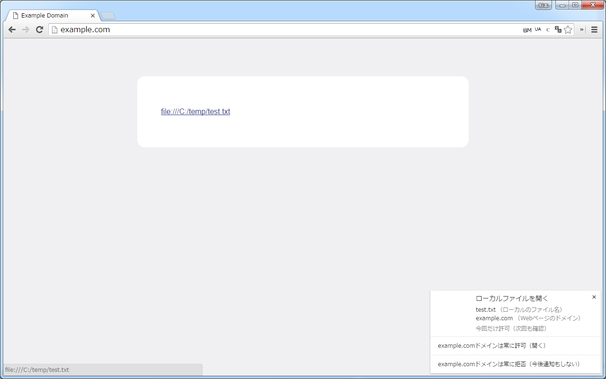
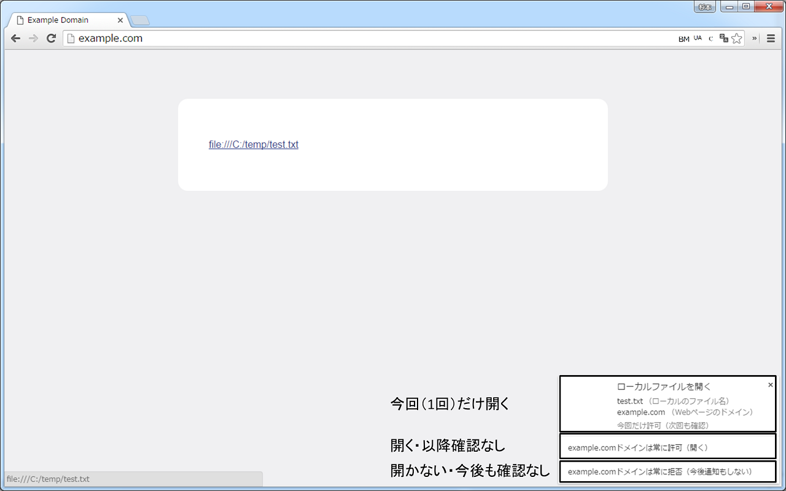

# 機能
IEと違いChromeだとローカルファイルへのリンク（file://～）があっても開けないので、拡張で開けるようにする

1. ローカルファイルへのリンクをクリック 
    
1. 確認ダイアログが表示 
    
1. アクションを選択
    * 今回だけ開く
    * （このドメインから）今後も常に開く
    * （このドメインから）今後も常に開かない 
    

# Chromeストア
https://chrome.google.com/webstore/detail/nikfmfgobenbhmocjaaboihbeocackld

# Todo
- [x] ローカルファイルのリンクをクリックしたらChromeでも開く
- [x] 開くことができるページを設定できるようにする（すべてのページで開けるとセキュリティ的にまずいので制限する）
- [ ] \<pre>や\<code>内のローカルファイルのパスをリンク化
- [ ] pptやxlsなどは直接ファイルを開くようにする（Native Messaging + レジストリ変更が必要）
- [ ] 通知による確認ではなく[Event.isTrusted - Web API インターフェイス | MDN](https://developer.mozilla.org/ja/docs/Web/API/Event/isTrusted "https://developer.mozilla.org/ja/docs/Web/API/Event/isTrusted")を使用してセキュリティを確保
